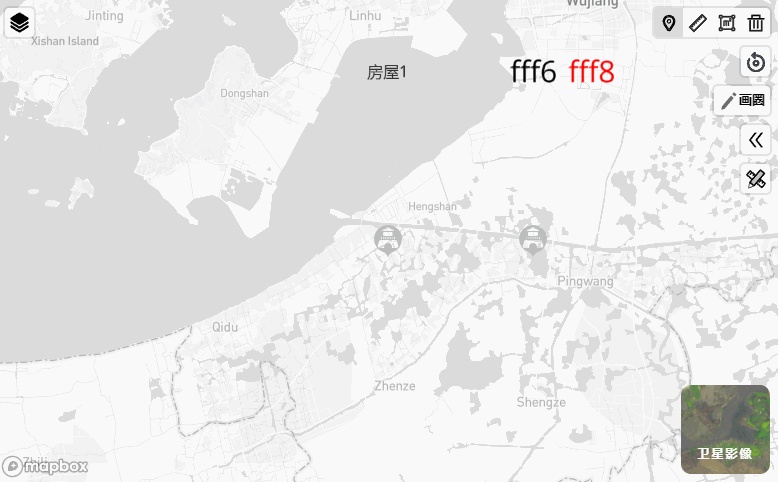
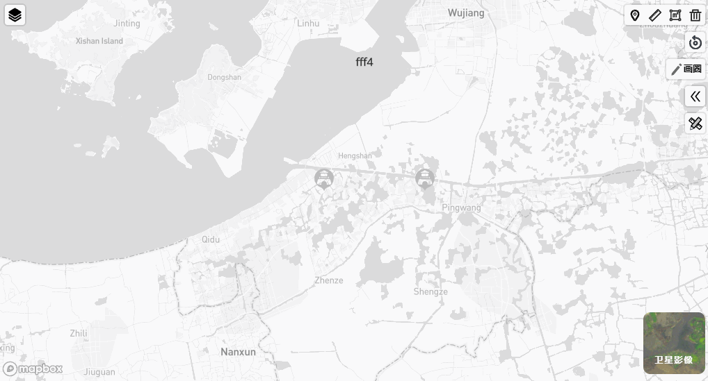
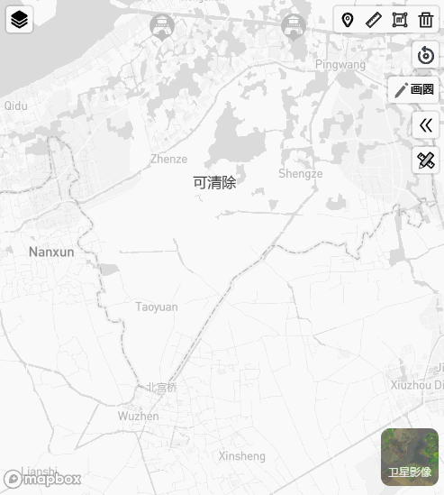
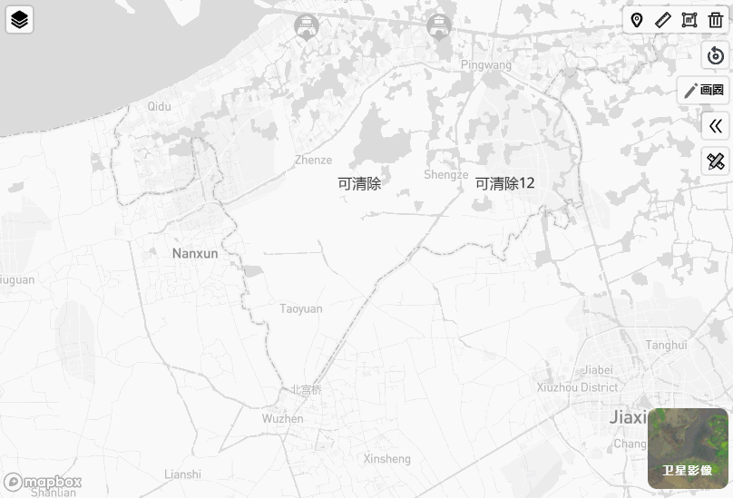
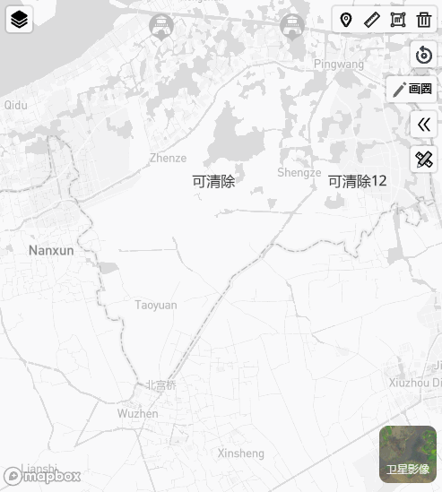
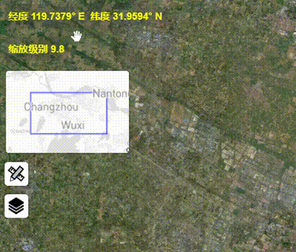
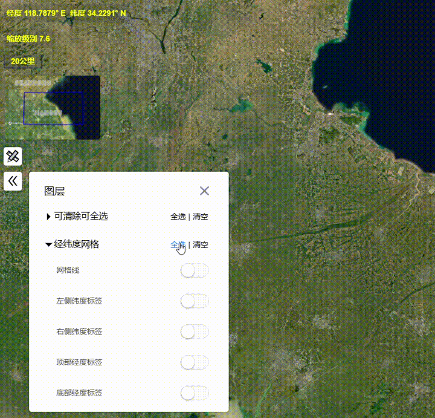

# mapbox-extensions [中文](./README.ZH.md)
[](https://www.npmjs.com/package/mapbox-extensions)  
mapboxgl controls : measure、switch map、switch layers、doodle、back ...
## DEMO
[examples](https://giserver.github.io/mapbox-extensions/example-dist/)
## usage   
### CDN 
``` html
<script src="https://cdn.jsdelivr.net/npm/mapbox-extensions@1.3.14/dist/mapbox-extensions.js"></script>
<link href="https://cdn.jsdelivr.net/npm/mapbox-extensions@1.3.14/dist/index.css" rel="stylesheet">
```  
### NODE 
```
npm install / yarn add  mapbox-extensions

import { SwitchLayerControl } from 'mapbox-extensions'
import 'mapbox-extensions/dist/index.css'
```
## Give a Star! :star:
If you like or are using this project to learn or start your solution, please give it a star. Thanks!

## features 
### `Measure` 
``` ts
map.addControl(new MeasureControl({
    horizontal : true,         //default false   
    btnBgColor : 'red',        //default '#ffffff'
    btnActiveColor:'red',      //default '#ddd'
    geometryClick:true,        //defualt false 
    enableModes:['LineString'],//default all
    onStart:()=>{},            
    onStop:()=>{},             
    measurePointOptions:{      
    },
    measureLineStringOptions:{ 
    },
    measurePolygonOptions:{    
    }
}))
``` 

*mouse operation* 
- left click : add a point
- right click : remove a point
- left double click : finish measure and start next

### `Back to origin`
``` ts
map.addControl(new BackToOriginControl({}))
```


### `Switch Map` *with swtch-layer*
``` ts
map.addControl(new SwitchMapControl({
    satelliteOption:{        
        name: "satellite",  
        textColor : 'red',   
        backgroundImage : "",
    },
    showSatelliteDefault:true, 
    extra:{  // default undefined, similar to SwitchLayerControlOptions
        nailActiveColor : "red" 
    }
}));
```


### `Switch Layer`
``` ts
map.addControl(new SwitchLayerControl({
    name:"Layer Manager" ,       
    position:"top-left",     

    selectAndClearAll:true, 
    selectAllLabel:"select all",   
    clearAllLabel:"clear all",    

    showToTop:true,         
    topLayerId:"",          

    layerGroups:{           
        "layer group 1":{
            mutex:true,         
            collapse:true,      
            uiType:"SwitchBtn", 
            layers:[
               {
                 name:"layer1",   
                 layer: {},     
                 fixed:true,    
                 zoom:-100,   
                 easeToOptions:{},   
                 mutex:true,          
                 mutexIdentity:"t1",  
                 active:true,         
                 backgroundImage:"",  
                 backgroundImageActive:"",
 
                 onVisibleChange:(visible:boolean)=>{}
               }
            ]
        }
    }
}));
```




### `Extend`
``` ts
map.addControl(new ExtendControl({
    img1 : "",              
    img2 : "",              
    content : div,          
    position : "top-left",  
    mustBe : "pc",         

    onChange:(open:boolean)=>{}
}));
```




### `Doodle` 

``` ts
map.addControl(new DoodleControl({

    name: '',           
    reName : '',        
    exitText : '',      
    lineColor : '',     
    lineWidth : 1,      
    polygonColor: '',   
    polygonOpacity : 1, 

    onStart: () => { measureControl.stop() },

    onDrawed: polygon => { () => { alert(JSON.stringify(polygon)) } },

    onClear:()=>{},

    onExit:()=>{}
}))
```


### `Location`
``` ts
map.addControl(new LocationControl({ fractionDigits: 4 }));
```
### `Zoom`
``` ts
map.addControl(new ZoomControl());
```
### `Eye`
``` ts
map.addControl(new EyeControl(map));
```

### `Grid`
``` ts
map.addControl(new GridControl({ show: true }));
```

