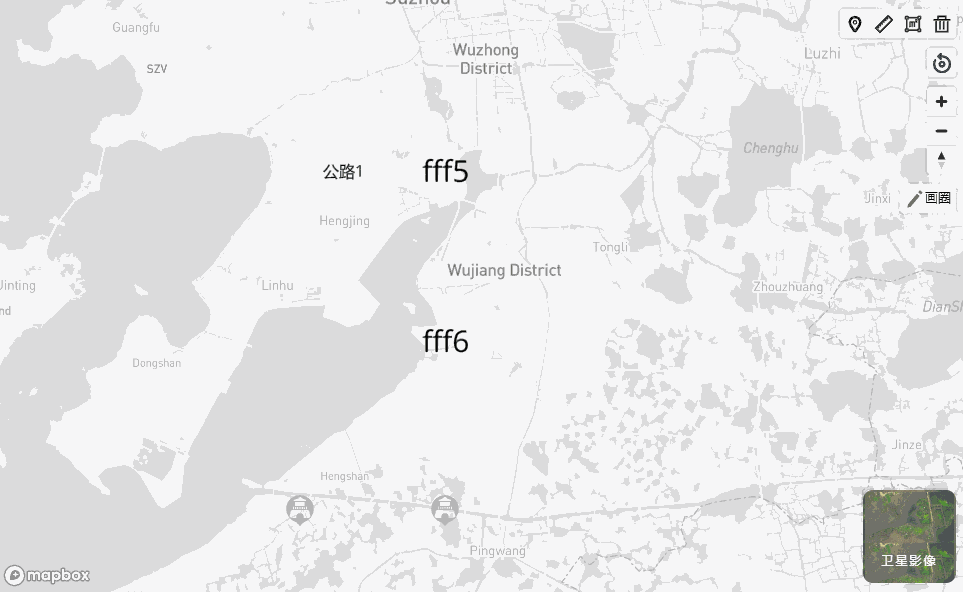
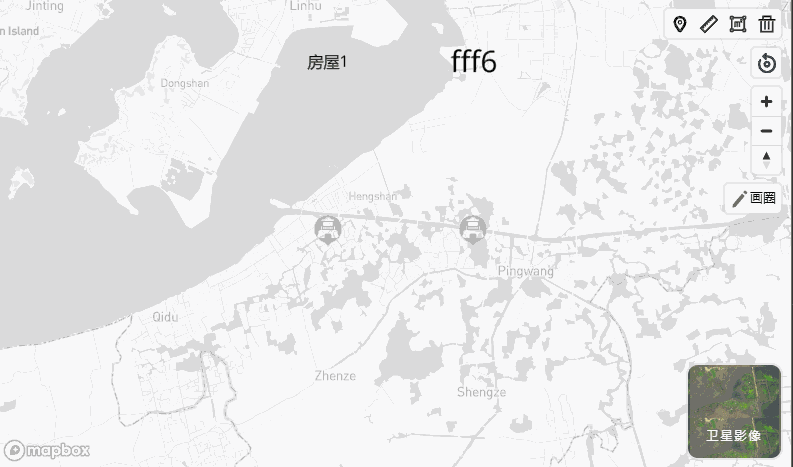
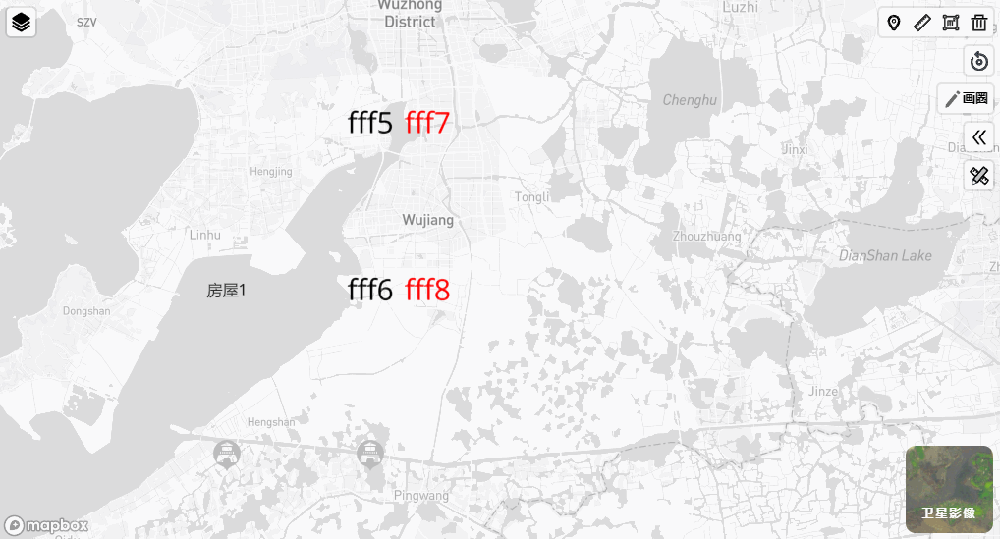
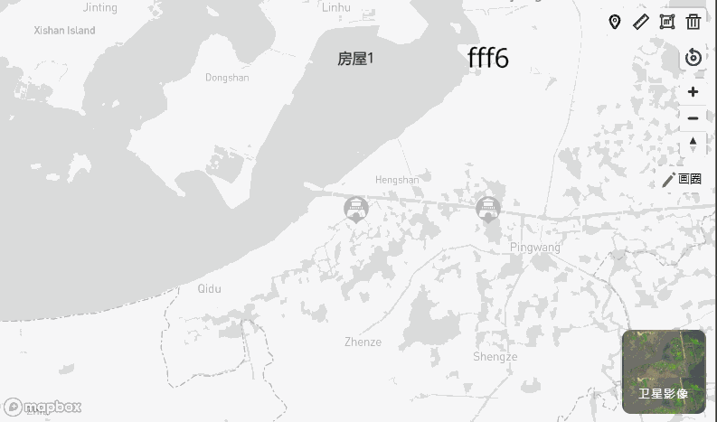

# mapbox-extensions [中文](./README.ZH.md)
measure, layer-group etc... in mapbox-gl
## dev & build 
```
yarn
yarn dev
yarn build
```
## usage  
[](https://www.npmjs.com/package/mapbox-extensions) 
1. make sure mapbox installed. 
2. `npm install` / `yarn add` `mapbox-extensions`. 
3. add `import 'mapbox-extensions'` at your entry file. 
4. add css : `import 'mapbox-extensions/dist/index.css'`
5. enjoy extensions.

## demo 
[examples](https://cocaine-coder.github.io/mapbox-extensions/example-dist/)

## Give a Star! :star:
If you like or are using this project to learn or start your solution, please give it a star. Thanks!

## features 
### `changeStyle`  
map.setStyle(...) will clear all sources and layers, use changeStyle can preserve sources and layers, but you must indicates layer ids
``` ts
const map = new mapboxgl.Map({...});
map.changeStyle(["layer-polygon","xxxlayer"] , options);
```

### `Layer Group`
``` ts
const map = new mapboxgl.Map({...});
const group = map.addLayerGroup('group1');

group.add(layer); // add a layer to group, it will add to map automatically
group.show = false; // all layers in this group will be unvisible
group.show = true;

console.log(group.layerIds); // ['layerid']

group.moveTo(); // move all layers in group to front
group.moveTo("beforeId"); // move all layers in group to the back of beforeId layer

group.remove('layerid');
group.removeAll();

map.removeLayerGroup('group1');
```  
### `Measure`  
a measure control implements mapboxgl.IControl, you can measure point(lng,lat), line(distance), polygon(area) with it. 



``` ts
const map = new mapboxgl.Map({...});

map.addControl(new MeasureControl(options)) // options can be null
```

*args* 
- [MeasureControlOptions](./lib/controls/MeasureControl.ts)  
- [MeasurePointOptions](./lib/features/Meature/MeasurePoint.ts)  
- [MeasureLineStringOptions](./lib/features/Meature/MeasureLineString.ts)  
- [MeasurePolygonOptions](./lib/features/Meature/MeasurePolygon.ts)  

*mouse operation* 
- left click : add a point
- right click : remove a point
- left double click : finish measure and start next

you can also config custom ui with this three class of measure， you can find all public functions in [MeasureBase](./lib/features/Meature/MeasureBase.ts), custom is so easy.

*add*  
- [MeasureControlOptions](./lib/controls/MeasureControl.ts) `geometryClick` creat measure geometry click handler to popup Copy/Delete feature


### `Back to origin`
map.easeTo，default zoom center pitch bearing from map

``` ts
map.addControl(new BackToOriginControl({
    //eastToOptions:{}
}))
```



### `Switch Map` 
- switch to satellite map 

    you can custom `textColor` `backgroundImage` and `name` 

- extra layer 

    by configuring the `extraLayers` parameter, activating the additional layer UI, providing layer grouping function, the hidden non-exclusive layer between groups and groups, groups can directly set each layer mutex through `mutex`, or configure the `mutex` parameter of `LayerItem` in the non-exclusive group to set the layer to be mutually exclusive with other layers.

    you can also set the layer to load into the map (display) by default by setting the active property, but this active will check whether the mutex is correct when initializing the control, and throw an exception if there is more than one active layer in the mutex group or one mutex layer and other active layers in the non-exclusive group.
``` ts
map.addControl(new SwitchMapControl({
    satelliteOption: {
        textColor: 'white',
        //backgroundImage: '/relics.png'
    },
    extra:{
      'foo':{
      }
    }
}));
```


### `Doodle` 
The control made for the circle, imitating the brush to draw polygons on the map, configure the expansion logic in the callback

``` ts
map.addControl(new DoodleControl({

    name: '', 
    reName : '',
    exitText : '',      
    lineColor : '',
    lineWidth : 1, 
    polygonColor: '', 
    polygonOpacity : 1,

    onStart: () => { measureControl.stop() },
    onDrawed: polygon => { () => { alert(JSON.stringify(polygon)) } },
    onClear:()=>{},
    onExit:()=>{}
}))
```

